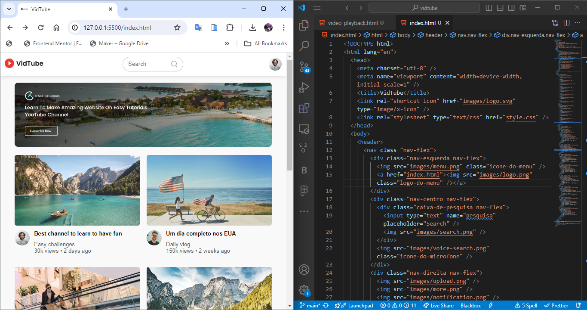

# Vidtube

Welcome to **Vidtube**, a clone-ish of two of the main YouTube pages developed using only HTML, CSS, and a tiny bit of JavaScript. This project was developed in 2023 to showcase front-end web development skills, focusing on layout and styling.

## Overview

**Vidtube** replicates the look and feel of two main YouTube pages. This project serves as a demonstration of creating responsive and visually appealing web pages using fundamental web technologies.

## Features

- **Responsive Design:** Ensures a seamless experience across different devices and screen sizes.
- **Modern UI/UX:** Mimics YouTube’s clean and user-friendly interface.
- **Minimal JavaScript:** Only a small amount.

## Tech Stack

- **HTML:** Structure of the web pages.
- **CSS:** Styling and layout of the web pages.
- **JavaScript:** Minimal scripts for added interactivity.

## Live Demo

Check out the live demo of the project [here](https://euricodande12.github.io/vidtube/).

## Usage
Feel free to explore and modify the code to understand better how HTML and CSS work together to create responsive web pages. This project is ideal for beginners looking to learn the basics of web development.

## Contributing
Contributions are welcome! Feel free to open an issue or submit a pull request if you have suggestions or improvements.

## License
This project is licensed under the MIT License. See the LICENSE file for more details.

## Acknowledgments
YouTube for the inspiration.
Various online tutorials and documentation for HTML, CSS, and JavaScript.

## Contact
For any questions or feedback, please reach out to euricodande12@gmail.com.
